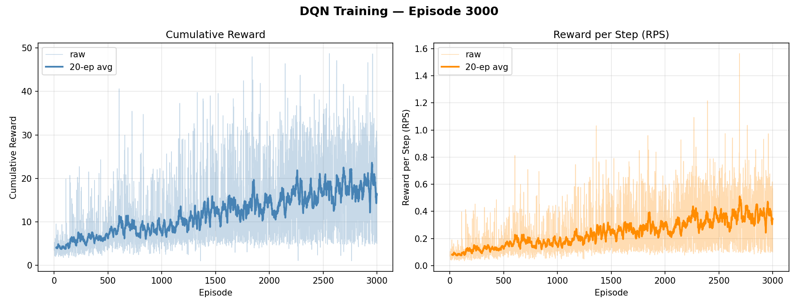
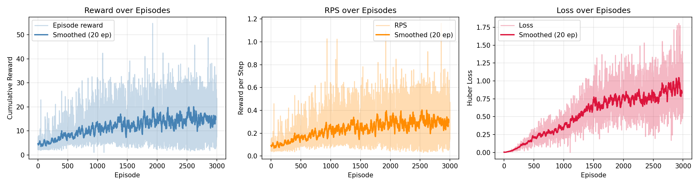

# Homework 2: Deep Q-Network for Robot Object Pushing

This folder contains my CMPE591 Homework 2 solution. The goal is to train a Deep Q-Network (DQN) policy that pushes an object to a target position in the MuJoCo environment.

## Objective

In this homework, the agent interacts with `Hw2Env` and selects one of `N_ACTIONS = 8` actions at each step.

- Reward function:
  - `reward = 1 / distance(ee, obj) + 1 / distance(obj, goal)`

where:

- `ee`: end-effector position
- `obj`: object position
- `goal`: goal position

## Folder Structure

```text
Homework_2/
  README.md
  src/
    homework2.py
    Homework_2_ver1.py
    Homework_2_ver2.py
    version_1/
      dqn_curves_final.png
      dqn_ep*.pt
    version_2/
      dqn_training_curves.png
      dqn_training_curves_ep*.png
```

## Implementations

Two DQN implementations are provided:

1. `src/Homework_2_ver1.py`
2. `src/Homework_2_ver2.py`

Shared core features:

- replay buffer for off-policy training,
- target network for stable Bellman targets,
- epsilon-greedy exploration,
- Huber loss (`smooth_l1_loss` / `SmoothL1Loss`),
- gradient clipping,
- support for pixel input (CNN) and high-level state input (MLP).

## Network and Hyperparameters

CNN architecture used in pixel mode:

```text
Conv2d(3, 32, 4, 2, 1), ReLU()
Conv2d(32, 64, 4, 2, 1), ReLU()
Conv2d(64, 128, 4, 2, 1), ReLU()
Conv2d(128, 256, 4, 2, 1), ReLU()
Conv2d(256, 512, 4, 2, 1), ReLU()
Global average pooling
Linear(512, N_ACTIONS)
```

Main hyperparameters:

- `GAMMA = 0.99`
- `EPSILON = 1.0`
- `EPSILON_DECAY = 0.999`
- `EPSILON_DECAY_ITER = 10`
- `MIN_EPSILON = 0.1`
- `LEARNING_RATE = 1e-4`
- `BATCH_SIZE = 32`
- `UPDATE_FREQ = 4`
- `TARGET_UPDATE_FREQ = 100`
- `BUFFER_LENGTH = 10000`
- `N_EPISODES = 3000`

## How to Run

Run from `Homework_2/src`:

```bash
python Homework_2_ver1.py
```

or

```bash
python Homework_2_ver2.py
```


## Version 1

File: `src/Homework_2_ver1.py`

Version 1 is a classic DQN pipeline focused on simplicity and full checkpoint resumability.

Detailed design:

- Observation mode:
  - `USE_PIXELS = False` by default, so it primarily trains with high-level state.
  - Can switch to pixel mode and use CNN.
- State handling:
  - high-level state is normalized before training (`x` and `y` ranges mapped to approximately `[-1, 1]`).
- Learning update:
  - standard DQN target with `max_a Q_target(s', a)`.
- Stability tools:
  - replay buffer,
  - target network synchronization,
  - Huber loss,
  - gradient clipping.
- Checkpointing:
  - saves online net + target net + epsilon + update counter every 50 episodes,

### Version 1 Final Plot



Plot explanation:

- Left panel: cumulative reward (raw curve + smoothed moving average).
- Right panel: reward per step (RPS), which normalizes reward by episode length.
- The raw curves are noisy as expected in DQN due to exploration and stochastic transitions.
- The smoothed curves show the real performance trend across training.

## Version 2
File: `src/Homework_2_ver2.py`

Version 2 is a refined DQN variant with better diagnostics and Double-DQN style target computation.

Detailed design:

- Observation mode:
  - `USE_HIGH_LEVEL_STATE = True` by default for faster experimentation.
  - Can also run in pixel mode with the same CNN backbone.
- State preprocessing:
  - explicit normalization helper for high-level state.
- Learning update:
  - Double-DQN style target:
  - next action selection by `policy_net`,
  - next action evaluation by `target_net`.
- Why this matters:
  - usually reduces Q-value overestimation compared to standard DQN max target.
- Diagnostics:
  - logs and plots reward, RPS, and loss.
- Saving behavior:
  - saves policy weights (`dqn_policy.pt`) instead of full training state.

### Version 2 Final Plot



Plot explanation:

- Reward and RPS panels provide policy-performance trend over episodes.
- Additional loss panel shows optimization behavior over time.
- Smoothed curves help reveal trend-level learning progress.
- Loss tracking provides better early warning for instability than reward-only plotting.

## Comparison of Version 1 and Version 2

| Aspect | Version 1 | Version 2 | Practical Effect |
|---|---|---|---|
| Target computation | Standard DQN target | Double-DQN style target |
| Logging/plots | Reward + RPS | Reward + RPS + Loss | 

Result-level comparison from final plots:

- Both versions show noisy episode-level reward and RPS, which is expected for DQN.
- Version 2 provides stronger interpretability because it includes loss dynamics.
- Version 1 is stronger operationally for long runs due to full-state checkpoints.

## Conclusion

- Both implementations satisfy the homework objective and learn useful pushing behavior.
- For both versions, smoothed reward and smoothed RPS should be used for final performance judgment, not single-episode fluctuations.

## Requirements

If imports fail, verify that your Python environment includes:

- `torch`
- `numpy`
- `matplotlib`
