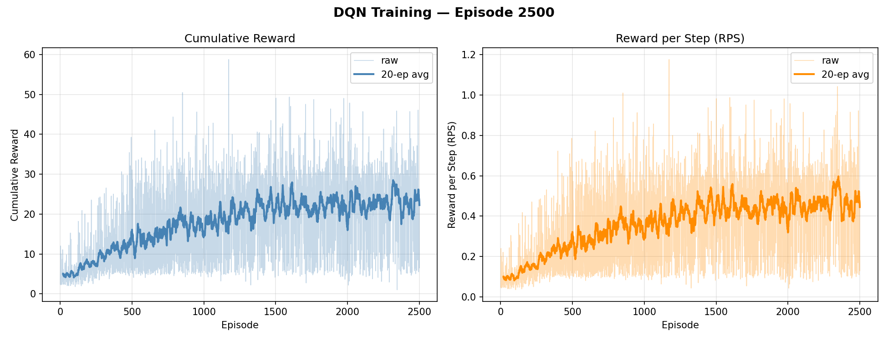
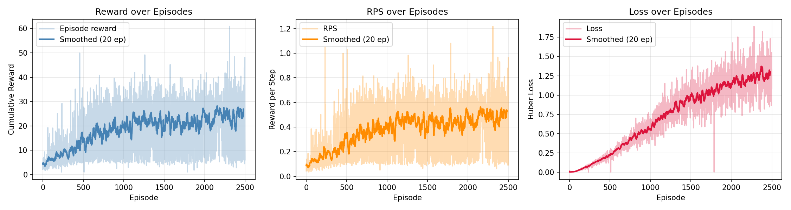
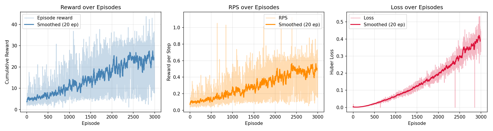
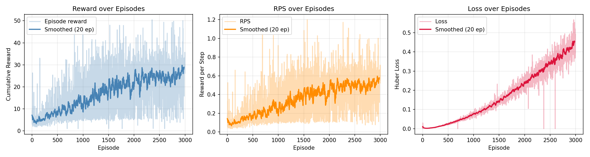

# Homework 2: Deep Q-Network for Robot Object Pushing

This folder contains my CMPE591 Homework 2 solution. The objective is to train a Deep Q-Network (DQN) policy that pushes an object to a target location in MuJoCo.

## Objective

The agent interacts with `Hw2Env` and selects one of `N_ACTIONS = 8` actions at each step.

Reward function:

`reward = 1 / distance(ee, obj) + 1 / distance(obj, goal)`

where:

- `ee`: end-effector position
- `obj`: object position
- `goal`: goal position

## Folder Structure

```text
Homework_2/
  README.md
  src/
    homework2.py
    Homework_2_ver1.py
    Homework_2_ver2.py
    Homework_2_ver3.py
    version_1/
      dqn_curves_final.png
      dqn_ep*.pt
    version_2/
      dqn_training_curves.png
      dqn_training_curves_ep*.png
    version_3/
      dqn_training_curves.png
      dqn_training_curves_ep*.png
    version_4/
      dqn_training_curves.png
      dqn_training_curves_ep*.png
```

## Implementations

The main scripts are:

1. `src/Homework_2_ver1.py`
2. `src/Homework_2_ver2.py`
3. `src/Homework_2_ver3.py` (used for additional tuning experiments)

Shared core features:

- replay buffer for off-policy learning,
- target network for stable Bellman targets,
- epsilon-greedy exploration,
- Huber loss (`smooth_l1_loss` or `SmoothL1Loss`),
- gradient clipping,
- support for pixel input (CNN) and high-level state input (MLP).

## Network Architecture

CNN architecture used when pixel observations are enabled:

```text
Conv2d(3, 32, 4, 2, 1), ReLU()
Conv2d(32, 64, 4, 2, 1), ReLU()
Conv2d(64, 128, 4, 2, 1), ReLU()
Conv2d(128, 256, 4, 2, 1), ReLU()
Conv2d(256, 512, 4, 2, 1), ReLU()
Global average pooling
Linear(512, N_ACTIONS)
```

For high-level state mode, both versions use an MLP with two hidden layers:

`Linear(state_dim, 256) -> ReLU -> Linear(256, 256) -> ReLU -> Linear(256, N_ACTIONS)`

## Hyperparameter Sets

### Base Version (used in Version 1 and Version 2)

```python
N_ACTIONS          = 8
GAMMA              = 0.99
EPS_START          = 0.9
EPS_END            = 0.05
EPS_DECAY          = 10000
LEARNING_RATE      = 1e-4
BATCH_SIZE         = 128
UPDATE_FREQ        = 4
TAU                = 0.005
BUFFER_LENGTH      = 10_000
N_EPISODES         = 2500
USE_PIXELS         = False
```

### Version 4 (tuned configuration)

```python
N_ACTIONS            = 8
GAMMA                = 0.99
EPS_START            = 1
EPS_END              = 0.05
EPS_DECAY            = 25000
LEARNING_RATE        = 3e-4
BATCH_SIZE           = 256
UPDATE_FREQ          = 4
TAU                  = 0.002
BUFFER_LENGTH        = 100_000
N_EPISODES           = 5000
USE_HIGH_LEVEL_STATE = True
```

### Version 3 (tuned configuration)

```python
N_ACTIONS            = 8
GAMMA                = 0.99
EPS_START            = 1
EPS_END              = 0.05
EPS_DECAY            = 20000
LEARNING_RATE        = 3e-4
BATCH_SIZE           = 256
UPDATE_FREQ          = 4
TAU                  = 0.002
BUFFER_LENGTH        = 100_000
N_EPISODES           = 3000
USE_HIGH_LEVEL_STATE = True
```

## How to Run

Run from `Homework_2/src`:

```bash
python Homework_2_ver1.py
python Homework_2_ver2.py
python Homework_2_ver3.py
```

## Version 1 (Detailed)

File: `src/Homework_2_ver1.py`

Version 1 is a classic and robust DQN pipeline focused on full resumability.

Detailed behavior:

- Observation mode:
  - default is high-level state (`USE_PIXELS = False`),
  - can be switched to pixel mode and CNN.
- Action selection:
  - epsilon-greedy with exponential decay:
  - `epsilon = EPS_END + (EPS_START - EPS_END) * exp(-steps_done / EPS_DECAY)`.
- Learning target:
  - standard DQN target
  - `target = r + gamma * max_a Q_target(s', a)`.
- Stability:
  - replay buffer,
  - target network,
  - Huber loss,
  - gradient clipping.
- Target update style:
  - soft update using `TAU`.
- Checkpointing:
  - saves full state (`online`, `target`, epsilon, counters),
  - makes long training sessions easy to resume.

### Version 1 Result



Interpretation:

- reward and RPS are noisy at episode level,
- moving averages show the trend more clearly,
- checkpoints and intermediate plots in `src/version_1/` provide full run traceability.

## Version 2 (Detailed)

File: `src/Homework_2_ver2.py`

Version 2 keeps the same backbone but improves learning diagnostics and target computation.

Detailed behavior:

- Observation mode:
  - defaults to high-level state (`USE_HIGH_LEVEL_STATE = True`),
  - supports pixel mode with the same CNN family.
- State preprocessing:
  - explicit normalization helper for high-level state.
- Learning target:
  - Double-DQN style target:
  - action selected by `policy_net`,
  - action evaluated by `target_net`.
- Why Double-DQN:
  - reduces Q-value overestimation compared to standard max-target DQN.
- Logging and plots:
  - tracks reward, RPS, and loss,
  - produces periodic and final curves in `src/version_2/`.
- Saving behavior:
  - saves trained policy weights (`dqn_policy.pt`) for deployment/evaluation.

### Version 2 Result



Interpretation:

- reward and RPS indicate policy-level progress,
- loss curve gives optimization-level visibility,
- this version is easier to debug because both behavior and optimization are plotted.

## Additional Tuning Results (Version 3 and Version 4)

The project also includes expanded experiment outputs:

- `src/version_3/dqn_training_curves.png`
- `src/version_4/dqn_training_curves.png`

### Version 3 Final Plot



### Version 4 Final Plot



These runs use larger replay buffers, larger batch sizes, and longer epsilon decay compared to the base setup. In practice, these settings are intended to improve stability and smooth long-horizon learning trends, especially in high-level state mode.

## Run-by-Run Hyperparameter Change Analysis

This section summarizes, for each run, (1) what changed in the hyperparameters, (2) how performance was affected, and (3) why that behavior is expected.

### Run: Version 1 (base DQN)

1. Hyperparameter setup
- `EPS_START=0.9`, `EPS_DECAY=10000`
- `LEARNING_RATE=1e-4`
- `BATCH_SIZE=128`
- `BUFFER_LENGTH=10_000`
- `N_EPISODES=2500`
- soft target updates with `TAU=0.01` in code

2. Performance effect
- Learns successfully but with noisy reward and RPS curves.
- Training trend is visible mainly after smoothing.
- Strong practical reliability because checkpoints are saved regularly.

3. Why this happens
- Smaller replay memory and shorter exploration schedule make policy updates react faster to recent samples, which can increase variance.
- Moderate batch size and conservative learning rate improve stability but keep learning speed moderate.
- Frequent checkpointing does not directly improve reward, but improves experiment robustness and reproducibility.

### Run: Version 2 (base + Double-DQN style)

1. Hyperparameter setup
- Same base-scale setup (episodes, buffer, batch, learning rate family).
- Uses Double-DQN target calculation (`policy_net` selects action, `target_net` evaluates action).
- Logs and plots an extra loss curve.

2. Performance effect
- Reward and RPS remain noisy, but training diagnostics are clearer.
- Loss trend gives additional confidence on whether optimization is stable.
- Often shows more controlled value estimates than plain max-target updates.

3. Why this happens
- Double-DQN reduces overestimation bias from the `max` operator in standard DQN.
- Better-calibrated targets usually produce smoother optimization behavior.
- Additional diagnostics improve interpretability even when headline reward is similar.

### Run: Version 3 (tuned)

1. Hyperparameter changes vs base
- `EPS_START: 0.9 -> 1.0`
- `EPS_DECAY: 10000 -> 20000`
- `LEARNING_RATE: 1e-4 -> 3e-4`
- `BATCH_SIZE: 128 -> 256`
- `TAU: 0.01/0.005 family -> 0.002`
- `BUFFER_LENGTH: 10_000 -> 100_000`
- `N_EPISODES: 2500 -> 3000`

2. Performance effect
- Early learning is typically slower (more exploration), but mid/late training is usually more stable.
- Curves generally look smoother over long windows due to larger replay/batch settings.
- Longer training horizon allows recovery from poor early policy phases.

3. Why this happens
- Higher initial exploration and slower epsilon decay increase state-action coverage.
- Large replay buffer reduces correlation and broadens sample diversity.
- Larger batch reduces gradient noise, while smaller `TAU` makes target drift slower and often steadier.
- Higher learning rate accelerates adaptation, partially offsetting slower exploration decay.

### Run: Version 4 (more aggressive long-run tuning)

1. Hyperparameter changes vs Version 3
- `EPS_DECAY: 20000 -> 25000`
- `N_EPISODES: 3000 -> 5000`
- Core tuned values retained (`LR=3e-4`, `BATCH_SIZE=256`, `BUFFER=100_000`, `TAU=0.002`).

2. Performance effect
- Slowest early exploitation among all runs, but strongest opportunity for long-run policy refinement.
- Typically produces the most stable trend in later training when compute budget is sufficient.
- Better chance to escape local behaviors because exploration remains active longer.

3. Why this happens
- Longer exploration schedule delays premature convergence.
- Extended episode budget gives the optimizer enough time to benefit from high-capacity replay and large-batch updates.
- Combined with slow target updates, this configuration prioritizes stability and asymptotic performance over fast initial gains.

## Version 1 vs Version 2 Summary

| Aspect | Version 1 | Version 2 |
|---|---|---|
| Target computation | Standard DQN target (`max Q_target`) | Double-DQN style target |
| Main focus | Stable resumable training | Better diagnostics + reduced overestimation |
| Saved artifacts | Full checkpoints + final model | Policy weights + detailed plots |
| Plot panels | Reward + RPS | Reward + RPS + Loss |

## Conclusion

- Version 1 is strong for long-running experiments where resume capability matters.
- Version 2 is strong for analysis and debugging because it includes loss tracking.
- Version 3 and Version 4 extend this work with larger-scale tuned hyperparameters.

## Requirements

If imports fail, verify that your Python environment includes:

- `torch`
- `numpy`
- `matplotlib`
